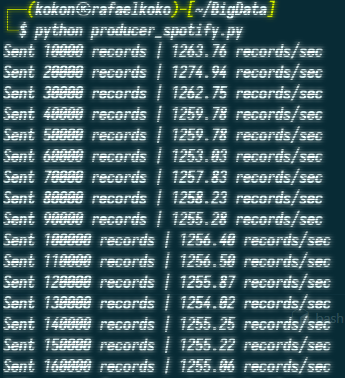
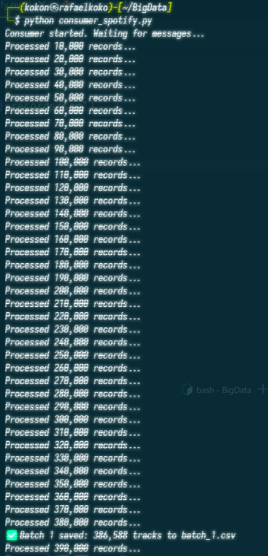
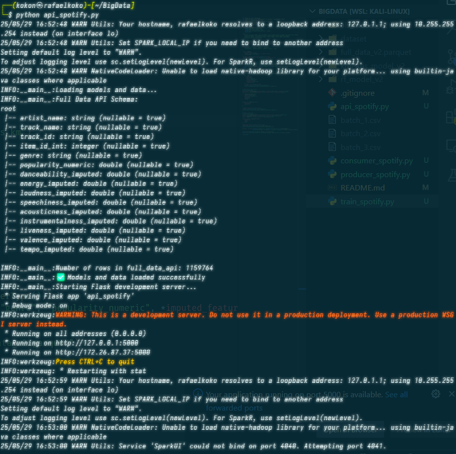
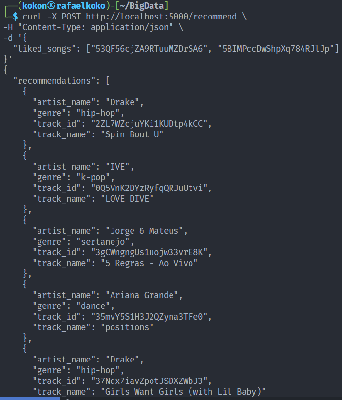
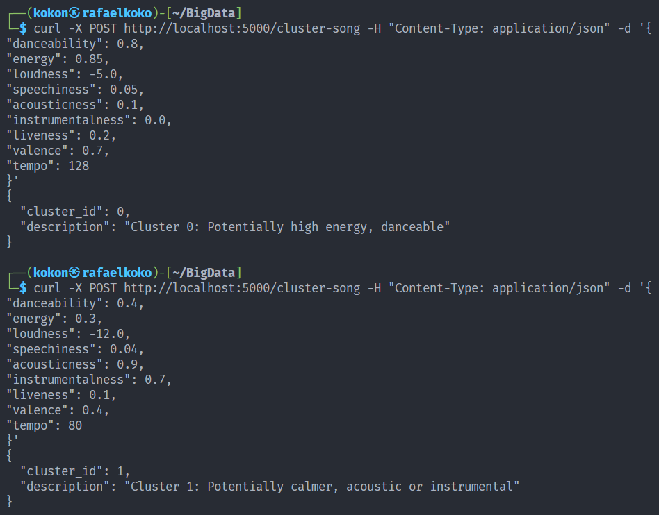

# Project Big Data 2 (Kafka + Spark)

## Big Data A

## Kelompok 4

| Nama                      | NRP        |
| ------------------------- | ---------- |
| Hazwan Adhikara Nasution  | 5027231017 |
| Rafael Gunawan            | 5027231019 |
| Mochamad Fadhil Saifullah | 5027231068 |

### Dataset : https://www.kaggle.com/datasets/amitanshjoshi/spotify-1million-tracks

## Langkah Pengerjaan

1. Install Kafka + Spark.
2. Jalankan server Kafka di <strong>Terminal 1<strong>.  
   `bin/kafka-server-start.sh config/server.properties`    
   
    

3. Buka <strong>Terminal Baru<strong> dan jalankan producer.  
   `python producer_spotify.py`  
     

   #### Producer akan mengirim data spotify ke server kafka dengan jeda tiap datanya antara 0.0001-0.001 detik.

    

4. Setelah itu, jalankan consumer di terminal yang sama.  
   `python consumer_spotify.py`    
    

   #### Menerima data dari server kafka dan membagi data tersebut menjadi 3 file dataset dalam format CSV (batch\_\*.csv).

    

5. Selanjutnya, jalankan spark di terminal yang sama.  
   `spark-submit train_spotify.py`    
   

   #### Spark akan membaca batch data yang dihasilkan oleh consumer dan masing-masing batch data tersebut akan di train menggunakan 3 model yang berbeda (rekomendasi, klasifikasi, dan clustering).

        

6. Kemudian, jalankan kode api di terminal yang sama.  
   `python api_spotify.py`    
   

   #### Kode API ini akan memuat model yang telah ditrain tadi dan akan menghasilkan 3 endpoint yang berbeda (/recommend, /predict-genre, dan /cluster-song).

    

7. Terakhir, lakukan testing pada 3 endpoint tersebut.  
   a). /recommend
   `curl -X POST http://localhost:5000/recommend \`    
   

   b). /predict-genre
   `curl -X POST http://localhost:5000/predict-genre \`    
     

   c). /cluster-song
   `curl -X POST http://localhost:5000/predict-genre \`  
   
